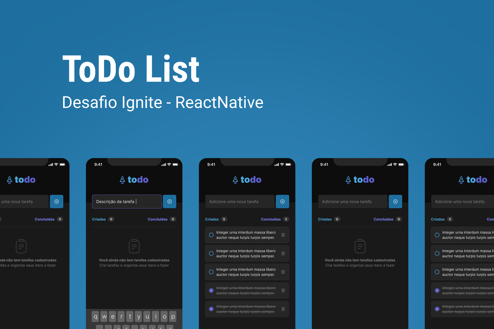

<h1 align="center">
  
</h1>

<h3 align="center">
  ToDo List Mobile :heavy_check_mark:
</h3>

<p align="center">Create, done, list and delete your tasks</p>

<p align="center">
  

  <a href="https://www.linkedin.com/in/matheralvs/" target="_blank" rel="noopener noreferrer">
    
  </a>
  
  <a href="https://github.com/matheralvs/todo-list-mobile/commits/main">
    
  </a>

  <a href="https://github.com/matheralvs/todo-list-mobile/issues">
    
  </a>
</p>

<p align="center">
  <a href="#-about-the-project">About the project</a> •
  <a href="#-technologies">Technologies</a> •
  <a href="#-getting-started">Getting started</a> •
  <a href="#-how-to-contribute">How to contribute</a>
</p>

## ✅ About the project

This project is the first ignite Rocketseat challenge from the reactjs/reactnative study platform.

The user can register one or several tasks, mark them as completed and delete them.

## 🚀 Technologies

Technologies that I used to develop this api

- [ReactNative](https://reactnative.dev/)
- [Expo](https://expo.dev/)
- [TypeScript](https://www.typescriptlang.org/)

## 💻 Getting started

**Clone the project and access the folder**

```bash
$ git clone https://github.com/matheralvs/todo-list-mobile.git && cd todo-list-mobile
```

**Follow the steps below**

Open it in the [Expo app](https://docs.expo.dev/bare/using-expo-client/) on your phone to view it. It will reload if you save edits to your files, and you will see build errors and logs in the terminal.

Sometimes you may need to reset or clear the React Native packager's cache. To do so, you can pass the ` --reset-cache` flag to the start script:

```bash
# Install the dependencies
$ npm i

# To finish, run
$ npm start --reset-cache

# Well done, project is started!
```

## 🤔 How to contribute

**Make a fork of this repository**

```bash
# Fork using GitHub official command line
# If you don't have the GitHub CLI, use the web site to do that.

$ gh repo fork matheralvs/todo-list-mobile
```

**Follow the steps below**

```bash
# Clone your fork
$ git clone your-fork-url && cd todo-list-mobile

# Create a branch with your feature
$ git checkout -b my-feature

# Make the commit with your changes
$ git commit -m 'Feature: My new feature'

# Send the code to your remote branch
$ git push origin my-feature
```

After your pull request is merged, you can delete your branch.

Made with :purple_heart: by Matheus Alves 🤝 [See my linkedin](https://www.linkedin.com/in/matheralvs/)
